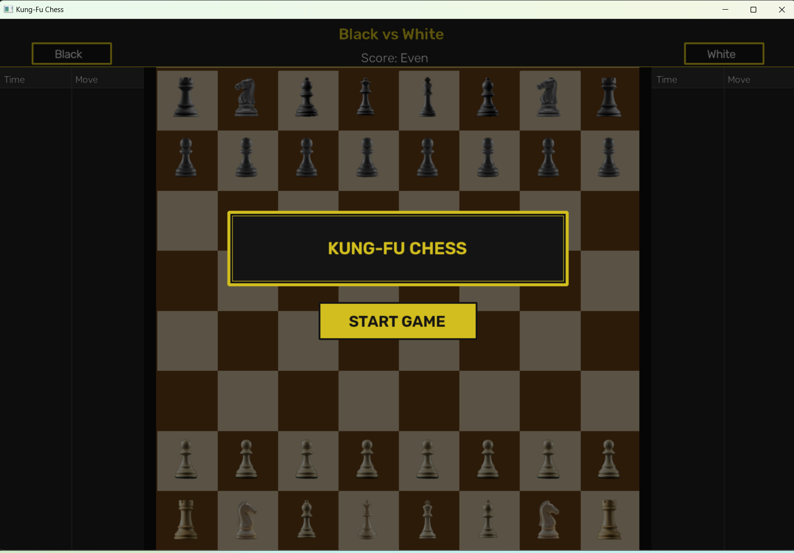
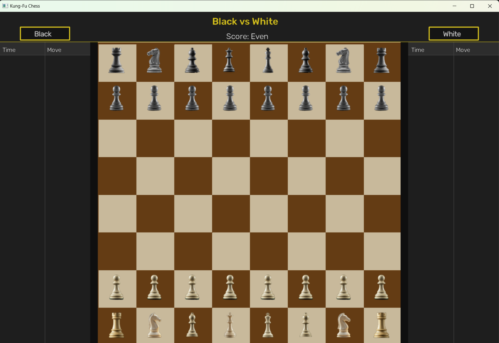
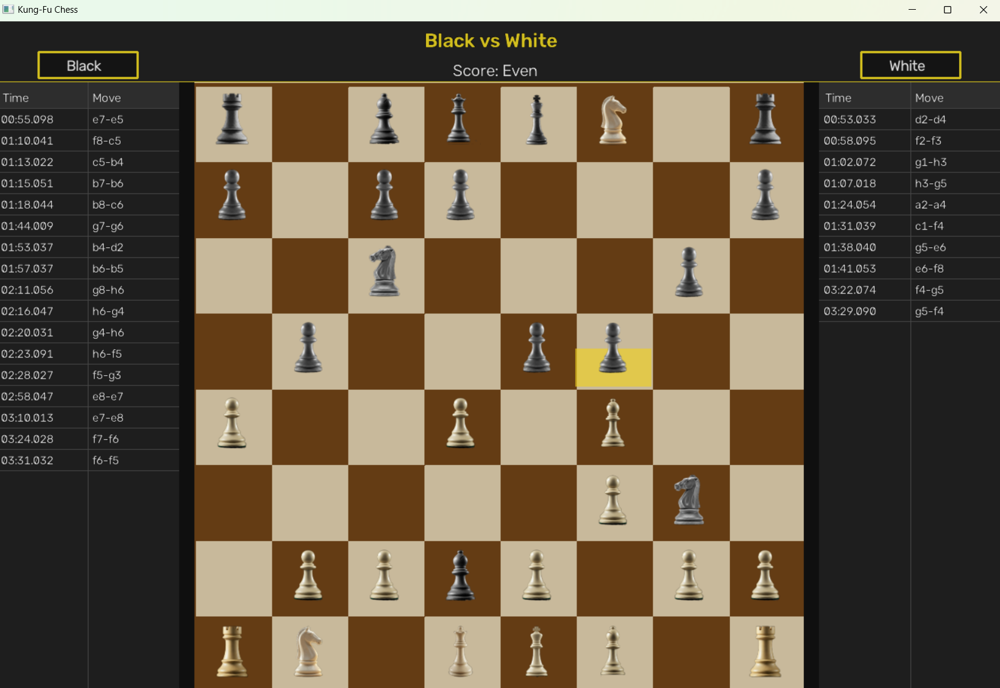
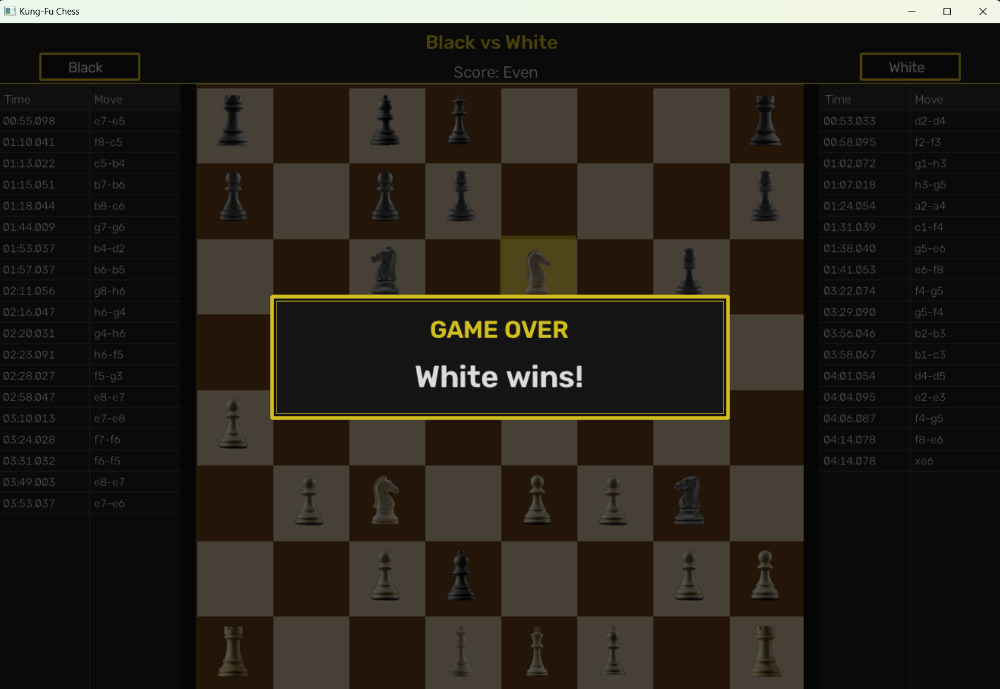

# Kung-Fu Chess

> ⚠️ **This project is currently under active development and is not finished yet.**

A real-time chess variant where both players move simultaneously — no turns, no waiting.
Inspired by the original Kung-Fu Chess game, built from scratch in Python using OpenCV for rendering.

---

## Screenshots

**Start Screen**
<p align="center">
  
</p>

**Gameplay**
<p align="center">
  
</p>

**Cooldown Overlays**
<p align="center">
  
</p>

**Game Over**
<p align="center">
  
</p>

---

## How It Works

- Both players can move any piece at any time — there are no turns
- After a piece moves it enters a **cooldown** state before it can move again
  - Regular move → **Long Rest** — gold overlay drains over the cell
  - Jump → **Short Rest** — purple overlay drains faster
- Capturing the enemy **King** ends the game
- A **START GAME** button freezes the board until both players are ready
- Pieces animate through states: `idle → moving → long_rest → idle` or `idle → jumping → short_rest → idle`

---

## Project Structure

```
kung-fu-chess/
│
├── assets/                        # README screenshots
│
└── logic/                         # All game code lives here
    │
    ├── board/                     # Board and piece data model
    │   ├── board.py               # Board grid, get/set piece
    │   ├── board_parser.py        # Parse text board definitions
    │   ├── board_printer.py       # Print board to text
    │   ├── board_validator.py     # Board integrity checks
    │   ├── piece.py               # Piece class + PieceState enum
    │   └── piece_type.py          # PieceType enum (K, Q, R, B, N, P)
    │
    ├── rules/                     # Move validation and piece rules
    │   ├── rule_engine.py         # Central rule dispatcher
    │   └── piece_rules.py         # Per-piece movement strategies
    │
    ├── realtime/                  # Real-time motion engine
    │   ├── real_time_arbiter.py   # Manages active moves and jumps
    │   └── motion.py              # MoveMotion / JumpMotion data classes
    │
    ├── game/
    │   └── game.py                # Game coordinator (moves, captures, game-over)
    │
    ├── controller/                # Input handling
    │   ├── input_controller.py    # Click → select / move / jump logic
    │   └── board_mapper.py        # Screen pixel → board cell mapping
    │
    ├── commands/                  # Text command system (for scripted tests)
    │   ├── commands.py
    │   ├── command_parser.py
    │   ├── click_command.py
    │   ├── jump_command.py
    │   ├── print_command.py
    │   └── wait_command.py
    │
    ├── graphics/                  # Rendering layer (OpenCV only, no game engine)
    │   ├── app.py                 # Main application loop
    │   ├── board_renderer.py      # Draws the board with custom colors
    │   ├── piece_renderer.py      # Draws pieces + cooldown overlays
    │   ├── layout.py              # Window/board coordinate math
    │   ├── gfx_config.py          # All graphics constants and colors
    │   ├── img_provider.py        # GameImg and WindowManager (cv2 wrappers)
    │   ├── input_adapter.py       # Routes window events to game controller
    │   │
    │   ├── sprites/               # Sprite loading and animation
    │   │   ├── sprite_loader.py   # Loads PNG frames from asset folders
    │   │   ├── animation.py       # Frame sequencing at a given FPS
    │   │   └── animation_state_machine.py  # Per-piece animation state
    │   │
    │   ├── observers/             # Game event observers (MVC pattern)
    │   │   ├── game_events.py     # Event dataclasses + observer base
    │   │   ├── game_event_source.py  # Diffs board snapshots → events
    │   │   ├── moves_log.py       # Logs moves per player with timestamps
    │   │   └── score_board.py     # Tracks and renders captured piece score
    │   │
    │   ├── panels/                # UI overlay panels
    │   │   ├── player_names_panel.py  # "Black vs White" title bar
    │   │   ├── game_over_panel.py     # Winner overlay on game end
    │   │   └── start_game_panel.py    # START GAME button on launch
    │   │
    │   └── assets/                # Sprite images and board image
    │       ├── board/             # board.png + highlight overlays
    │       └── pieces/            # Per-piece animated sprite folders
    │           └── <color><Type>/ # e.g. wP/, bK/
    │               └── states/
    │                   ├── idle/
    │                   ├── move/
    │                   ├── jump/
    │                   ├── long_rest/
    │                   └── short_rest/
    │
    ├── errors/                    # Custom exception types
    ├── texttests/                 # Text-script based integration test runner
    │
    ├── tests/
    │   ├── unit/                  # Unit tests (pytest)
    │   └── integration/           # Text-script integration scenarios
    │
    ├── config.py                  # Game constants (timing, piece values, etc.)
    ├── img.py                     # Base Img class (cv2 wrapper)
    └── main.py                    # Entry point (text mode)
```

---

## Running the Game

```bash
cd logic
py graphics/app.py
```

## Running Tests

```bash
cd logic
py -m pytest tests/
```

---

## Tech Stack

- **Python 3.10+**
- **OpenCV** — rendering, window management, input events
- **NumPy** — image compositing and alpha blending
- **pytest** — unit and integration tests

---

## What's Done

- [x] Full chess rule engine (all piece types)
- [x] Real-time simultaneous movement
- [x] Cooldown system (long rest / short rest)
- [x] Animated sprites per piece state
- [x] Cooldown overlay animations (gold / purple) draining over the full cell
- [x] Move log with timestamps per player
- [x] Score tracking
- [x] Game-over detection and winner overlay
- [x] START GAME button — board is frozen until clicked
- [x] Dark theme UI with gold accents

## What's Still In Progress

- [ ] Network multiplayer
- [ ] Sound effects
- [ ] Player name input screen
- [ ] Game replay / history
