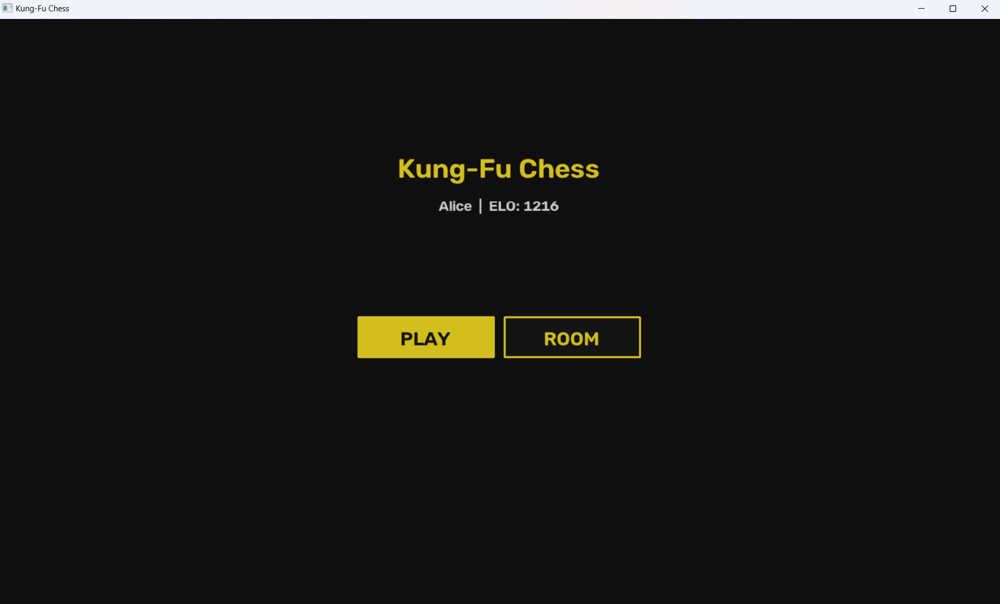
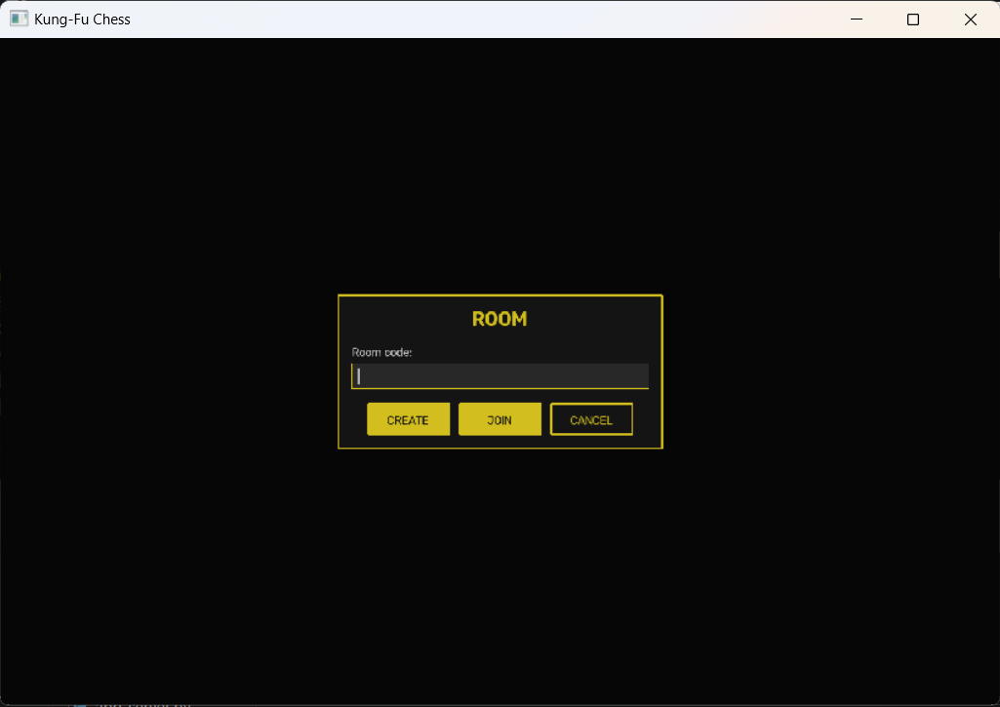
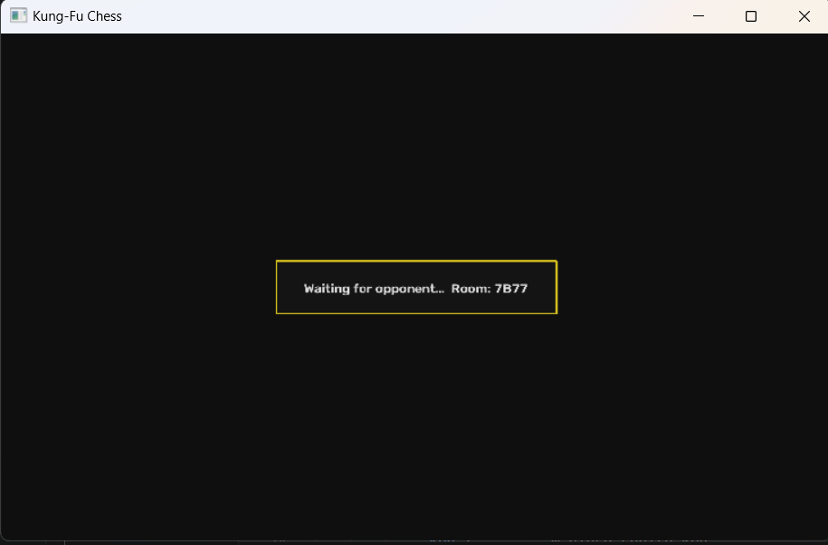

# Kung-Fu Chess

> ⚠️ **This project is currently under active development and is not finished yet.**

A real-time chess variant where both players move simultaneously — no turns, no waiting.
Inspired by the original Kung-Fu Chess game, built from scratch in Python using OpenCV for rendering.
Supports network multiplayer via a WebSocket server with login, ELO rating, and room-based matchmaking.

---

## Screenshots

**Home Screen**
<p align="center">
  
</p>

**Room Dialog**
<p align="center">
  
</p>

**Waiting Room**
<p align="center">
  
</p>

**Room with Both Players**
<p align="center">
  
</p>

**Gameplay**
<p align="center">
  
</p>

**Cooldown Overlays**
<p align="center">
  
</p>

**Game Over**
<p align="center">
  
</p>

---

## How It Works

- Both players can move any piece at any time — there are no turns
- After a piece moves it enters a **cooldown** state before it can move again
  - Regular move → **Long Rest** — gold overlay drains over the cell
  - Jump → **Short Rest** — purple overlay drains faster
- Capturing the enemy **King** ends the game
- A **START GAME** button freezes the board until both players are ready
- Pieces animate through states: `idle → moving → long_rest → idle` or `idle → jumping → short_rest → idle`

---

## Project Structure

```
kung-fu-chess/
│
├── assets/                        # README screenshots
│
├── shared/                        # Shared protocol (messages, enums, constants)
│
├── server/                        # WebSocket game server
│   ├── auth/                      # Login / registration
│   ├── db/                        # SQLite user database
│   ├── session/                   # Room, player connection, game session
│   ├── protocol/                  # Serializer (game state → wire format)
│   ├── rating/                    # ELO rating service
│   └── main.py                    # Server entry point
│
├── client/                        # Networked client
│   ├── views/                     # View state machine (home, room, game…)
│   ├── network/                   # WebSocket client + board mirror
│   ├── graphics/                  # Rendering layer (OpenCV)
│   │   ├── panels/                # UI overlays (room dialog, game over…)
│   │   ├── sprites/               # Sprite loading and animation
│   │   └── observers/             # Score board, move log
│   └── main.py                    # Client entry point
│
└── logic/                         # Core game engine (also runs standalone)
    │
    ├── board/                     # Board and piece data model
    │   ├── board.py               # Board grid, get/set piece
    │   ├── board_parser.py        # Parse text board definitions
    │   ├── board_printer.py       # Print board to text
    │   ├── board_validator.py     # Board integrity checks
    │   ├── piece.py               # Piece class + PieceState enum
    │   └── piece_type.py          # PieceType enum (K, Q, R, B, N, P)
    │
    ├── rules/                     # Move validation and piece rules
    │   ├── rule_engine.py         # Central rule dispatcher
    │   └── piece_rules.py         # Per-piece movement strategies
    │
    ├── realtime/                  # Real-time motion engine
    │   ├── real_time_arbiter.py   # Manages active moves and jumps
    │   └── motion.py              # MoveMotion / JumpMotion data classes
    │
    ├── game/
    │   └── game.py                # Game coordinator (moves, captures, game-over)
    │
    ├── controller/                # Input handling
    │   ├── input_controller.py    # Click → select / move / jump logic
    │   └── board_mapper.py        # Screen pixel → board cell mapping
    │
    ├── graphics/                  # Standalone local rendering (OpenCV)
    │   └── app.py                 # Local app entry point
    │
    ├── errors/                    # Custom exception types
    ├── texttests/                 # Text-script based integration test runner
    │
    ├── tests/
    │   ├── unit/                  # Unit tests (pytest)
    │   └── integration/           # Text-script integration scenarios
    │
    ├── config.py                  # Game constants (timing, piece values, etc.)
    └── main.py                    # Entry point (text mode)
```

---

## Running the Game

**Server:**
```bash
cd server
py main.py
```

**Client:**
```bash
cd client
py main.py
```

**Local (no network):**
```bash
cd logic
py graphics/app.py
```

## Running Tests

```bash
cd logic
py -m pytest tests/
```

---

## Tech Stack

- **Python 3.10+**
- **OpenCV** — rendering, window management, input events
- **NumPy** — image compositing and alpha blending
- **WebSockets** — real-time client/server communication
- **SQLite** — user accounts and ELO persistence
- **pytest** — unit and integration tests

---

## What's Done

- [x] Full chess rule engine (all piece types)
- [x] Real-time simultaneous movement
- [x] Cooldown system (long rest / short rest)
- [x] Animated sprites per piece state
- [x] Cooldown overlay animations (gold / purple) draining over the full cell
- [x] Move log with timestamps per player
- [x] Score tracking
- [x] Game-over detection and winner overlay
- [x] START GAME button — board is frozen until clicked
- [x] Dark theme UI with gold accents
- [x] Network multiplayer (WebSocket server + client)
- [x] Login / registration with ELO rating
- [x] Room system — create or join a room by code
- [x] Matchmaking

## What's Still In Progress

- [ ] Sound effects
- [ ] Player name input screen
- [ ] Game replay / history
