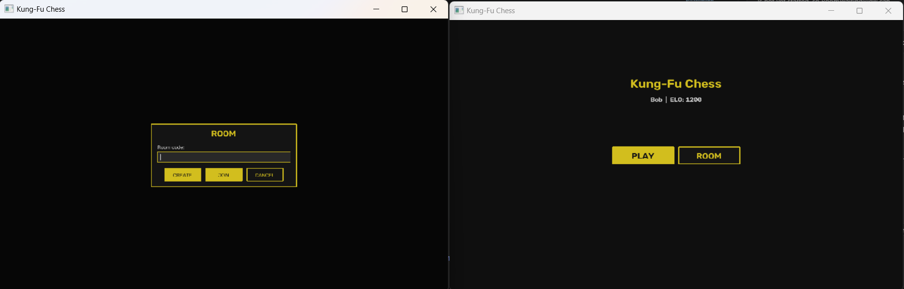
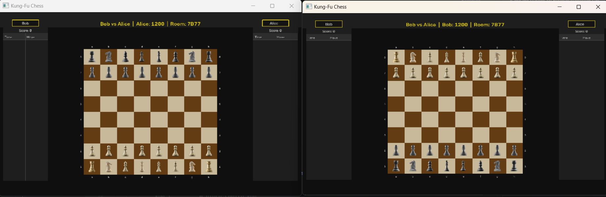
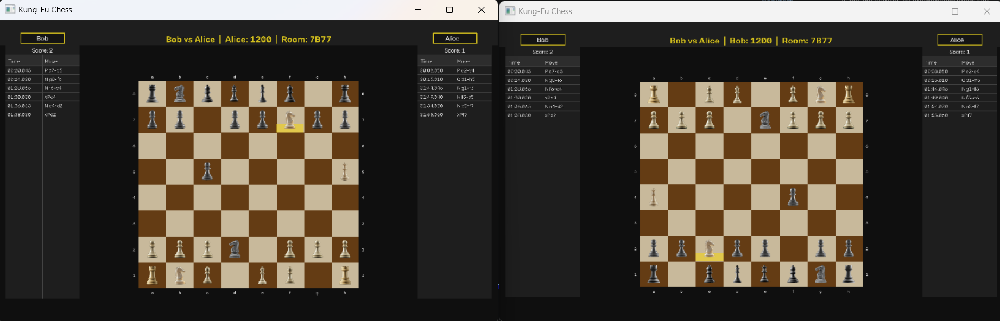
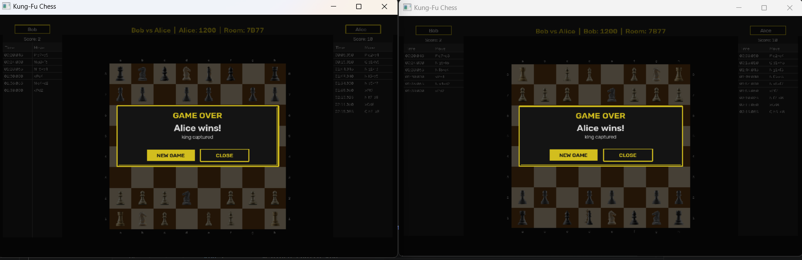

# Kung-Fu Chess

A real-time chess variant where both players move simultaneously — no turns, no waiting.
Built from scratch in Python with OpenCV rendering, a fully split microservice backend, WebSocket multiplayer, ELO matchmaking, and a Kubernetes-ready deployment.

---

## Screenshots

**Home Screen and Room Dialog**
<p align="center">
  
</p>

**Gameplay**
<p align="center">
  
</p>

**Cooldown Overlays**
<p align="center">
  
</p>

**Game Over**
<p align="center">
  
</p>

---

## How It Works

- Both players move any piece at any time — there are no turns
- After a piece moves it enters a **cooldown** before it can move again
  - Regular move → **Long Rest** — gold overlay drains over the cell
  - Jump → **Short Rest** — purple overlay drains faster
- Capturing the enemy **King** ends the game
- Pieces animate through states: `idle → moving → long_rest → idle` or `idle → jumping → short_rest → idle`
- If a player disconnects, their opponent gets a 20-second grace countdown before the game is forfeited

---

## Architecture

The backend is a fully split microservice system designed to scale to **100M registered users** and **10M concurrent players**.

```
                        Clients
                           │
              ┌────────────┴────────────┐
              │ REST/HTTP               │ WebSocket
              ▼                         ▼
        API Gateway              WS Gateway
              │                         │
       ┌──────┘              ┌──────────┤
       ▼                     ▼          ▼
  Auth Service          Matchmaker   Rooms API
       │                     │
       ▼                     ▼
  PostgreSQL              NATS Event Bus
                             │
                      Game Allocator
                             │
                          Redis
                             │
                    Game Server Shard
                    (N worker processes)
                             │
                      Rating Service
                             │
                        PostgreSQL
```

### Services

| Service | Responsibility | Port |
|---|---|---|
| **API Gateway** | Login, register — REST entry point for clients | 8080 |
| **WS Gateway** | WebSocket entry point — validates sessions, routes to shard | 5555 |
| **Auth Service** | Credential validation, user registration, session tokens | 8000 |
| **Rooms API** | Room creation and lookup (Redis-backed) | 8001 |
| **Rating Service** | ELO calculation and persistence at game end | 8002 |
| **Matchmaker** | ELO-based queue, pairs players, publishes `kfc.matched` to NATS | 8003 |
| **Game Allocator** | Consumes `kfc.matched`, picks least-loaded shard worker, publishes `kfc.allocated` | 8004 |
| **Game Server Shard** | Authoritative `GameSession` per room, multiprocess (one worker per CPU core) | 5556–55xx |
| **Redis** | Sessions, room→shard mapping, matchmaking queue, worker heartbeats | 6379 |
| **PostgreSQL** | Users, ELO ratings, durable storage | 5432 |
| **NATS** | Internal control-plane event bus (`kfc.matched`, `kfc.allocated`) | 4222 |

### Event Flow (Matchmaking)

```
Player clicks Play
  → WS Gateway enqueues in Matchmaker
  → Matchmaker pairs by ELO → publishes kfc.matched to NATS
  → Game Allocator picks least-loaded worker → writes Redis → publishes kfc.allocated
  → WS Gateway resolves Future → sends ShardConnectMsg to both clients
  → Clients reconnect directly to the assigned Game Shard worker
  → GameSession starts
```

### Game Server Multiprocessing

Each Game Server Shard container runs one worker process per CPU core. Every worker:
- Owns its own asyncio event loop and a shard of active rooms
- Heartbeats `shard:worker:{pid} → {host, port, rooms}` into Redis every 10 seconds
- The Game Allocator reads all heartbeat keys and always picks the worker with the fewest active rooms

---

## Project Structure

```
kung-fu-chess/
│
├── assets/                        # README screenshots
│
├── shared/                        # Shared protocol (messages, enums, constants)
│
├── services/                      # Microservice implementations
│   ├── api-gateway/               # REST entry point (login/register)
│   ├── ws-gateway/                # WebSocket entry point (relay + matchmaking)
│   ├── backend/                   # Shared image: auth, rooms-api, rating
│   │   ├── auth/
│   │   ├── rooms_api/
│   │   └── rating/
│   ├── matchmaker/                # ELO queue + NATS publisher
│   ├── game-allocator/            # Shard selection + NATS consumer
│   └── game-shard/                # Authoritative game engine (multiprocess)
│
├── k8s/                           # Kubernetes manifests (one per service)
│
├── server/                        # Shared server utilities
│   ├── db/                        # PostgreSQL CRUD (psycopg2)
│   ├── session/                   # GameSession, PlayerConnection
│   ├── protocol/                  # Game state serializer
│   ├── rating/                    # ELO logic
│   └── logging/                   # Structured server logger
│
├── client/                        # Networked client
│   ├── views/                     # View state machine (home, room, game…)
│   ├── network/                   # WebSocket client + board mirror
│   ├── auth/                      # Terminal login prompt
│   └── graphics/                  # Rendering layer (OpenCV)
│       ├── panels/                # UI overlays (room dialog, game over…)
│       ├── sprites/               # Sprite loading and animation
│       └── observers/             # Score board, move log
│
└── logic/                         # Core game engine (runs standalone too)
    ├── board/                     # Board and piece data model
    ├── rules/                     # Move validation (all piece types)
    ├── realtime/                  # Real-time motion engine
    ├── game/                      # Game coordinator
    ├── controller/                # Click → move/jump logic
    ├── graphics/                  # Standalone local rendering
    ├── texttests/                 # Text-script integration test runner
    └── tests/                     # Unit + integration tests (pytest)
```

---

## Running the Game

### Local (no network, no server needed)
```bash
cd logic
py graphics/app.py
```

### Docker Compose (full stack, single machine)
```bash
docker compose up --build
```
Then run the client:
```bash
cd client
py main.py --host localhost --port 5555 --api-port 8080
```

### Kubernetes (Docker Desktop)
Enable Kubernetes in Docker Desktop settings, then:
```bash
kubectl apply -f k8s/postgres.yaml -f k8s/redis.yaml -f k8s/nats.yaml
kubectl apply -f k8s/auth-service.yaml -f k8s/rating-service.yaml -f k8s/rooms-api.yaml
kubectl apply -f k8s/matchmaker.yaml -f k8s/game-shard.yaml -f k8s/game-allocator.yaml
kubectl apply -f k8s/api-gateway.yaml -f k8s/ws-gateway.yaml
```
Then run the client:
```bash
cd client
py main.py --host localhost --port 30555 --api-port 30080
```

### Playing from Another Machine / Country
Deploy the Docker Compose stack to any cloud VM (AWS EC2, GCP, etc.):
1. SSH into the VM, clone the repo, run `docker compose up -d`
2. Open ports `8080`, `5555`, `5556`, `5557` in the firewall
3. Set `SHARD_PUBLIC_HOST=<VM_PUBLIC_IP>` in `docker-compose.yml`
4. Players connect with:
```bash
py main.py --host <VM_PUBLIC_IP> --port 5555 --api-port 8080
```

---

## Running Tests

```bash
cd logic
py -m pytest tests/
```

---

## Tech Stack

| Layer | Technology |
|---|---|
| **Language** | Python 3.11 |
| **Rendering** | OpenCV + NumPy |
| **Networking** | WebSockets (`websockets` library) |
| **HTTP services** | FastAPI + Uvicorn |
| **Event bus** | NATS (`nats-py`) |
| **Hot state** | Redis |
| **Durable storage** | PostgreSQL (`psycopg2`) |
| **Containerisation** | Docker + Docker Compose |
| **Orchestration** | Kubernetes (manifests in `k8s/`) |
| **Testing** | pytest |

---

## Features

### Gameplay
- [x] Real-time simultaneous movement — no turns
- [x] Full chess rule engine (all 6 piece types, all legal moves)
- [x] Cooldown system — long rest after moves, short rest after jumps
- [x] Animated sprites per piece state (idle, moving, jumping, resting)
- [x] Gold / purple cooldown overlay animations draining over each cell
- [x] King capture ends the game instantly
- [x] Disconnect grace period — 20-second countdown before forfeit
- [x] Game-over screen with winner overlay

### UI
- [x] Dark theme with gold accents
- [x] Move log with timestamps per player
- [x] Score tracking
- [x] Room dialog — create or join by 4-character code
- [x] Waiting room screen while opponent joins
- [x] Connecting / searching screens with elapsed time

### Multiplayer & Backend
- [x] Login and registration with bcrypt password hashing
- [x] ELO rating system — updates after every game
- [x] ELO-based matchmaking queue
- [x] Room system — private games via room code
- [x] Session tokens via Redis (short-lived, single-use)
- [x] Disconnect detection with opponent notification

### Infrastructure
- [x] Fully split microservice architecture (9 services)
- [x] NATS event bus for matchmaking control plane
- [x] Game Server multiprocessing — one worker process per CPU core
- [x] Least-loaded worker selection via Redis heartbeats
- [x] PostgreSQL replacing SQLite — multi-writer safe
- [x] Docker Compose for local development
- [x] Kubernetes manifests for all services

### What's Still In Progress
- [ ] Sound effects
- [ ] Game replay / history
- [ ] Multi-region deployment
- [ ] Horizontal Pod Autoscaler (HPA) manifests
